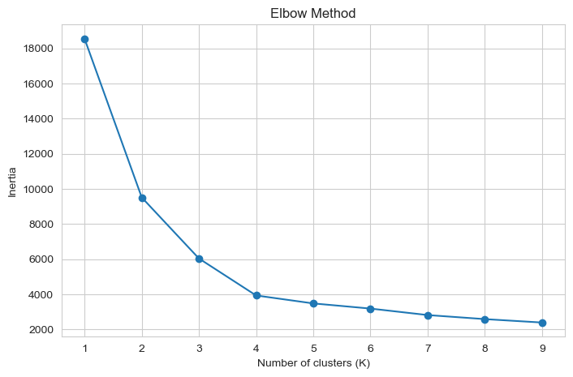
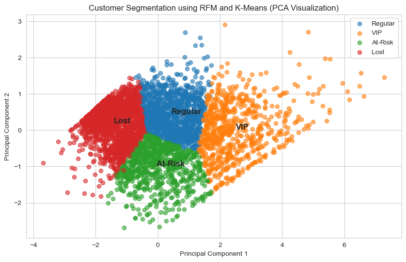

# Customer Behavior Segmentation using RFM Analysis and K-Means Clustering

---

## Project Overview

Understanding customer behavior is essential for businesses to improve marketing strategies, increase retention, and optimize revenue.

This project develops a customer segmentation system using transactional retail data. By analyzing purchasing behavior, customers are grouped into meaningful segments that support data-driven business decisions.

---

## Problem Statement

Businesses often face challenges in identifying:

* Their most valuable customers
* Customers at risk of churn
* Effective strategies for targeted marketing

This project addresses these challenges using RFM analysis and clustering techniques.

---

## Dataset

* Source: UCI Online Retail Dataset
* Domain: E-commerce / Retail
* Time Period: 2010–2011
* Records: ~500,000 transactions

### Key Features

* `InvoiceNo` – Transaction identifier
* `CustomerID` – Unique customer identifier
* `InvoiceDate` – Timestamp of purchase
* `Quantity` – Number of items purchased
* `UnitPrice` – Price per item

---

## Project Pipeline

```text
Raw Data → Cleaning → Feature Engineering → RFM → Transformation → Clustering → Visualization → Insights
```

---

## Data Cleaning

* Removed missing values in `CustomerID`
* Filtered invalid transactions:

  * Negative quantities (returns)
  * Non-positive unit prices
* Created a new feature:

```text
TotalPrice = Quantity × UnitPrice
```

---

## RFM Feature Engineering

Customer-level features were created using RFM analysis:

| Feature   | Description              |
| --------- | ------------------------ |
| Recency   | Days since last purchase |
| Frequency | Number of transactions   |
| Monetary  | Total spending           |

---

## Data Transformation

### Log Transformation

* Reduced skewness in feature distributions
* Compressed extreme values

### Feature Scaling

* Applied StandardScaler
* Ensured all features contribute equally to clustering

---

## Choosing the Number of Clusters

### Elbow Method



The elbow point suggests an optimal number of clusters:

**K = 4**

---

## K-Means Clustering

* Applied K-Means clustering with K = 4
* Assigned each customer to a cluster

### Evaluation

* Silhouette Score used to assess clustering quality

---

## PCA Visualization

To visualize customer segments, dimensionality was reduced using PCA.



### Observation

Clusters are clearly separated, indicating distinct customer behavior patterns.

---

## Customer Segments

### VIP Customers

* High frequency
* High spending
* Recent activity

These customers contribute significantly to revenue and should be retained through loyalty programs.

---

### Regular Customers

* Moderate activity
* Average spending

These customers form a stable base and can be targeted for upselling.

---

### At-Risk Customers

* Recently active
* Low engagement and spending

These customers present an opportunity for targeted re-engagement strategies.

---

### Lost Customers

* Inactive
* Low frequency
* Low spending

These customers require reactivation campaigns or can be deprioritized.

---

## Business Insights

* A small segment of customers contributes disproportionately to revenue
* A large portion of customers shows low engagement
* Customer behavior varies significantly and benefits from segmentation

---

## Business Applications

* Personalized marketing campaigns
* Customer retention strategies
* Targeted promotions and discounts
* Churn prevention initiatives

---

## Tech Stack

* Python
* Pandas, NumPy
* Matplotlib, Seaborn
* Scikit-learn

---

## Project Structure

```text
customer-behavior-segmentation/
│
├── data/
├── notebooks/
├── images/
│   ├── elbow_method.png
│   └── pca_clusters.png
├── README.md
└── requirements.txt
```

---

## How to Run

```bash
git clone <your-repo-link>
cd customer-behavior-segmentation
pip install -r requirements.txt
jupyter notebook
```

---

## Future Improvements

* Experiment with alternative clustering methods (DBSCAN, hierarchical clustering)
* Build an interactive dashboard (Streamlit or Power BI)
* Deploy as a production-ready service

---

## Author

Anand
